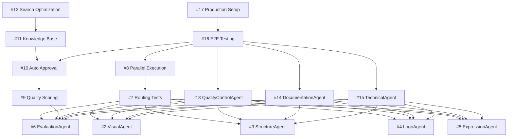

# CoordinatorAgent 実行計画 - サブIssue実行戦略

**作成日**: 2025-10-15
**作成者**: CoordinatorAgent (Simulated Analysis)
**対象**: 16 サブIssues の最適実行順序

---

## 📊 依存関係分析

### 依存グラフ



---

## 🌊 Wave実行計画（最適化版）

### Wave 1: 基盤整備（並列実行）
**期間**: 2-3日
**並列度**: 5 タスク同時実行

| Issue | タスク | 担当エージェント | 工数 | 優先度 |
|-------|--------|-----------------|------|--------|
| #2 | VisualAgent 準拠修正 | SystemRegistryAgent | 4h | High |
| #3 | StructureAgent 準拠修正 | SystemRegistryAgent | 4h | High |
| #4 | LogoAgent 準拠修正 | SystemRegistryAgent | 4h | High |
| #5 | ExpressionAgent 準拠修正 | SystemRegistryAgent | 4h | High |
| #6 | EvaluationAgent 準拠修正 | SystemRegistryAgent | 4h | High |

**Wave 1 合計工数**: 20h（並列実行で 4h）
**成果物**: 全コアエージェント BaseAgent 準拠完了

---

### Wave 2: 統合テスト（順次実行）
**期間**: 3-4日
**並列度**: 順次実行（依存関係あり）

| Issue | タスク | 担当エージェント | 工数 | 依存 |
|-------|--------|-----------------|------|------|
| #7 | タスクルーティングテスト | CoordinatorAgent | 8h | Wave 1 |
| #8 | 並列実行テスト | CoordinatorAgent | 12h | #7 |

**Wave 2 合計工数**: 20h（順次実行）
**成果物**: エージェント間連携動作確認

---

### Wave 3: 品質システム（順次実行）
**期間**: 2-3日
**並列度**: 順次実行（依存関係あり）

| Issue | タスク | 担当エージェント | 工数 | 依存 |
|-------|--------|-----------------|------|------|
| #9 | 品質スコアリング統合 | EvaluationAgent | 8h | #6 |
| #10 | 自動承認システム | QualityControlAgent* | 10h | #9 |

\* QualityControlAgent は Issue #13 で実装予定だが、暫定的に手動実装

**Wave 3 合計工数**: 18h
**成果物**: 自動品質評価システム稼働

---

### Wave 4: ナレッジ拡張（順次実行）
**期間**: 3-4日
**並列度**: 順次実行

| Issue | タスク | 担当エージェント | 工数 | 依存 |
|-------|--------|-----------------|------|------|
| #11 | プロジェクト知識追加 | DocumentationAgent* | 12h | Wave 3 |
| #12 | 検索最適化 | TechnicalAgent* | 10h | #11 |

\* 新規エージェント（Wave 5で実装）使用前提だが、暫定的に手動実行

**Wave 4 合計工数**: 22h
**成果物**: 強化されたナレッジベース

---

### Wave 5: 新規エージェント開発（並列実行）
**期間**: 4-5日
**並列度**: 3 タスク同時実行

| Issue | タスク | 担当エージェント | 工数 | 依存 |
|-------|--------|-----------------|------|------|
| #13 | QualityControlAgent 実装 | SystemRegistryAgent | 16h | Wave 1 |
| #14 | DocumentationAgent 実装 | SystemRegistryAgent | 16h | Wave 1 |
| #15 | TechnicalAgent 実装 | SystemRegistryAgent | 16h | Wave 1 |

**Wave 5 合計工数**: 48h（並列実行で 16h）
**成果物**: 3 つの新規エージェント

---

### Wave 6: 実戦投入（順次実行）
**期間**: 3-4日
**並列度**: 順次実行

| Issue | タスク | 担当エージェント | 工数 | 依存 |
|-------|--------|-----------------|------|------|
| #16 | E2Eワークフローテスト | 全エージェント | 12h | Wave 2,3,5 |
| #17 | 本番環境設定 | AuditAgent + CostMonitoringAgent | 8h | #16 |

**Wave 6 合計工数**: 20h
**成果物**: 本番環境稼働

---

## ⏱️ タイムライン

### 最短完了スケジュール（並列実行最適化）

```
Week 1:
  Day 1-2:  Wave 1 (基盤整備) - 並列実行
  Day 3-5:  Wave 2 (統合テスト) - 順次実行

Week 2:
  Day 1-2:  Wave 3 (品質システム) - 順次実行
  Day 3-5:  Wave 4 (ナレッジ拡張) - 順次実行

Week 3:
  Day 1-3:  Wave 5 (新規エージェント) - 並列実行
  Day 4-5:  Wave 6 (実戦投入) - 順次実行
```

**総期間**: 約 3 週間（15 営業日）
**総工数**: 148h（並列実行考慮: 約 98h）

---

## 🔀 並列実行最適化

### 並列実行可能グループ

#### Group A: Wave 1（同時実行）
- Issue #2, #3, #4, #5, #6
- 理由: 独立したエージェント修正、相互依存なし
- 並列度: 5
- 実行時間: 4h（最長タスク基準）

#### Group B: Wave 5（同時実行）
- Issue #13, #14, #15
- 理由: 独立した新規エージェント実装
- 並列度: 3
- 実行時間: 16h（最長タスク基準）

### 順次実行必須グループ

#### Chain 1: 統合テスト系
- Wave 1 → Issue #7 → Issue #8
- 理由: 前段階完了が次の前提条件

#### Chain 2: 品質評価系
- Issue #6 → Issue #9 → Issue #10
- 理由: EvaluationAgent修正 → 統合 → 自動化

#### Chain 3: ナレッジ系
- Wave 3 → Issue #11 → Issue #12
- 理由: 品質システム → 知識追加 → 最適化

#### Chain 4: 最終投入
- Wave 2,3,5 → Issue #16 → Issue #17
- 理由: 全コンポーネント完成後のE2Eテスト

---

## 🎯 リソース配分

### エージェント稼働率

| エージェント | 担当Issue数 | 総工数 | 稼働期間 |
|-------------|-----------|--------|---------|
| SystemRegistryAgent | 8 | 68h | Week 1-3 |
| CoordinatorAgent | 3 | 20h | Week 1-2 |
| EvaluationAgent | 1 | 8h | Week 2 |
| AuditAgent | 1 | 4h | Week 3 |
| CostMonitoringAgent | 1 | 4h | Week 3 |
| QualityControlAgent* | 1 | 10h | Week 2 |
| DocumentationAgent* | 1 | 12h | Week 2 |
| TechnicalAgent* | 1 | 10h | Week 2 |

\* 暫定的に手動実装（Wave 5 で正式実装）

### 並列実行リソース要求

- **Wave 1**: 5 エージェント並列 → SystemRegistryAgent を 5インスタンス
- **Wave 5**: 3 エージェント並列 → SystemRegistryAgent を 3インスタンス

---

## 🚨 リスクと緩和策

### Risk 1: Wave 1 の遅延
- **影響**: 全体スケジュール遅延
- **確率**: 低
- **緩和策**:
  - Issue #2-6 は独立タスクなので、1つ遅延しても他は進行可能
  - 最低 Issue #6（EvaluationAgent）を優先完了

### Risk 2: 新規エージェント実装遅延（Wave 5）
- **影響**: Wave 4 の一部タスクが手動実装のまま
- **確率**: 中
- **緩和策**:
  - Wave 4 を Wave 5 の後に移動（順序入れ替え）
  - 手動実装で進めて、後でエージェント化

### Risk 3: E2E テスト失敗（Issue #16）
- **影響**: 本番投入遅延
- **確率**: 中
- **緩和策**:
  - Wave 1-5 の各段階で小規模テスト実施
  - 問題の早期発見・修正

---

## ✅ 成功基準

### Wave 完了基準

| Wave | 完了基準 |
|------|---------|
| Wave 1 | 全 5 エージェント準拠テスト合格（100%） |
| Wave 2 | CoordinatorAgent ルーティングテスト成功率 ≥ 95% |
| Wave 3 | 自動品質評価スコア精度 ≥ 90% |
| Wave 4 | ナレッジベース検索精度 ≥ 85% |
| Wave 5 | 新規エージェント準拠テスト合格（100%） |
| Wave 6 | E2E テスト成功率 100% + 本番環境稼働 |

### 全体成功基準

- ✅ 全 16 Issues 完了
- ✅ 全エージェント準拠テスト合格
- ✅ E2E ワークフローテスト成功
- ✅ 本番環境稼働
- ✅ スケジュール: 3 週間以内
- ✅ 品質スコア: 平均 ≥ 85点

---

## 📋 次のアクション

### 即座実行

1. **Wave 1 開始準備**
   - Issue #2-6 の GitHub Issues 作成
   - SystemRegistryAgent 準備
   - 並列実行環境確認

2. **実行開始**
   ```bash
   # Issue #2-6 を並列実行
   miyabi workflow 2 --repo hiromima/EStack-Brand-Builder &
   miyabi workflow 3 --repo hiromima/EStack-Brand-Builder &
   miyabi workflow 4 --repo hiromima/EStack-Brand-Builder &
   miyabi workflow 5 --repo hiromima/EStack-Brand-Builder &
   miyabi workflow 6 --repo hiromima/EStack-Brand-Builder &
   wait
   ```

3. **進捗モニタリング**
   - 各 Issue の PR 確認
   - 品質ゲート通過確認
   - 次 Wave へ移行判断

---

**作成**: CoordinatorAgent (Analysis Mode)
**承認**: Ready for Execution
**ステータス**: 実行準備完了

May the Force be with you.
