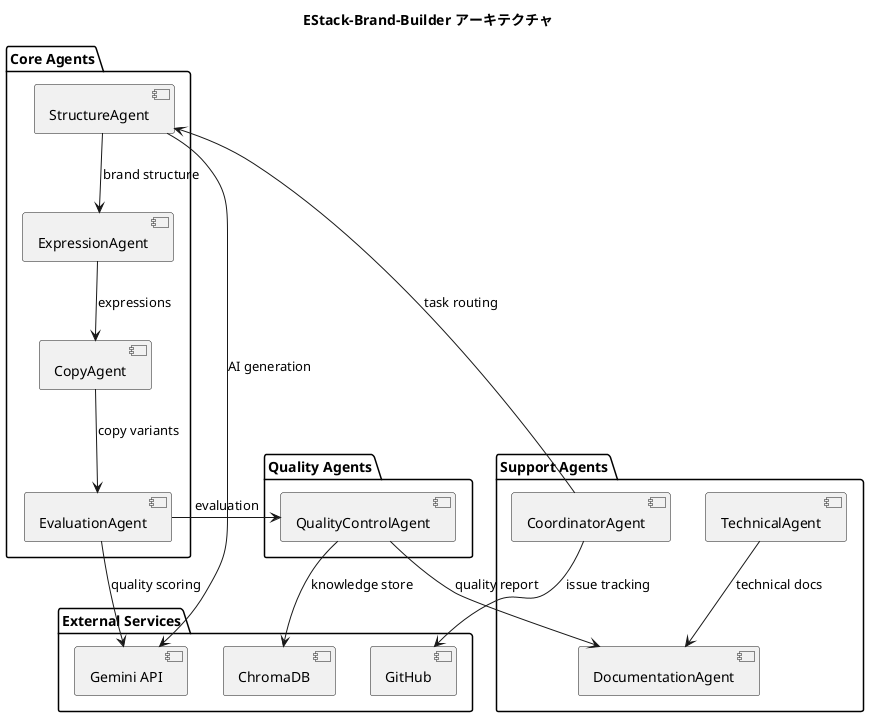
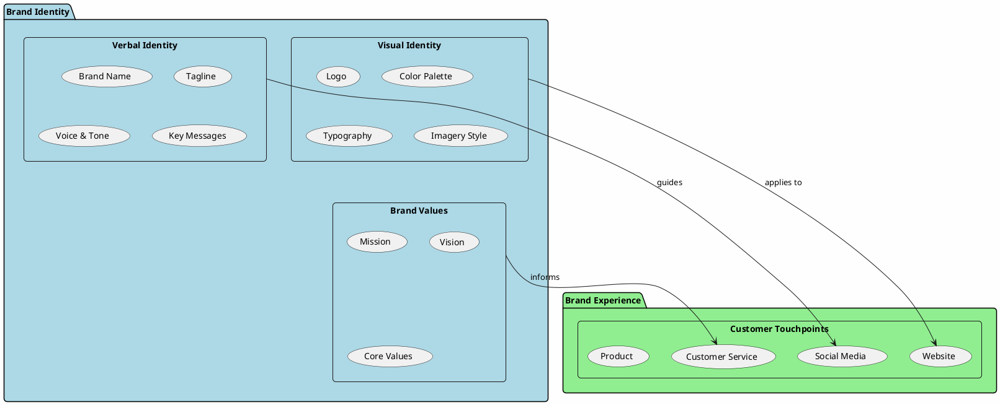
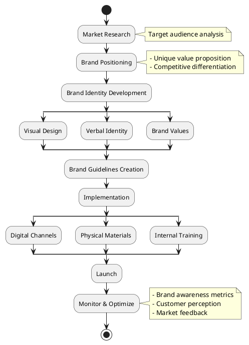
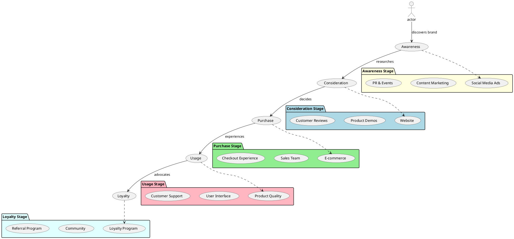
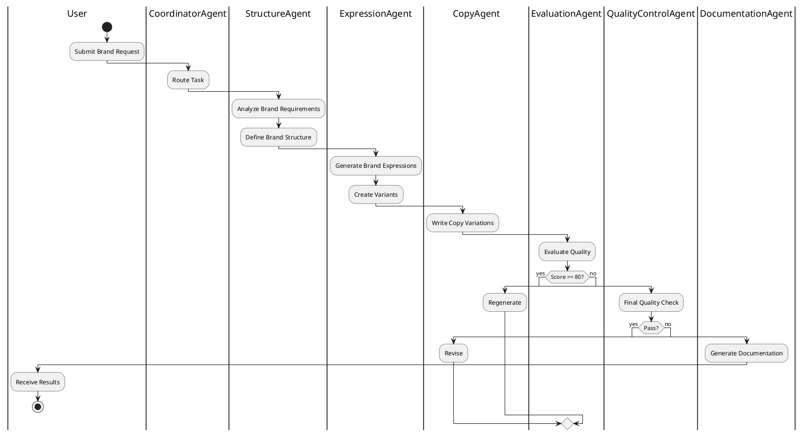
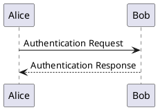
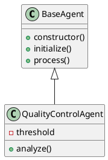
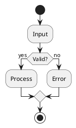
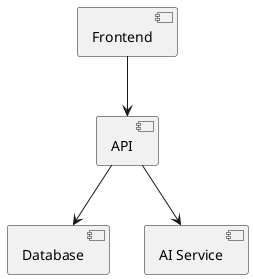

# PlantUML セットアップガイド - Mac

**更新日**: 2025-10-15

## 概要

PlantUML を使用して、ブランドアーキテクチャやシステム概念図を作成します。

## インストール

### 1. Homebrew でインストール

```bash
# Java（必須）
brew install openjdk@21

# Graphviz（図の描画エンジン）
brew install graphviz

# PlantUML
brew install plantuml
```

### 2. Java パスの設定

```bash
# .zshrc または .bash_profile に追加
echo 'export PATH="/opt/homebrew/opt/openjdk@21/bin:$PATH"' >> ~/.zshrc
source ~/.zshrc
```

### 3. インストール確認

```bash
# Java 確認
java -version

# PlantUML 確認
plantuml -version

# Graphviz 確認
dot -version
```

## 使用方法

### 1. PlantUML ファイル作成

`diagrams/brand-architecture.puml`:



### 2. 図の生成

```bash
# PNG 生成
plantuml diagrams/brand-architecture.puml

# SVG 生成（推奨：スケーラブル）
plantuml -tsvg diagrams/brand-architecture.puml

# PDF 生成
plantuml -tpdf diagrams/brand-architecture.puml

# 複数ファイル一括生成
plantuml diagrams/*.puml
```

### 3. プレビュー（自動更新）

```bash
# ファイル変更を監視して自動生成
plantuml -gui diagrams/brand-architecture.puml
```

## ブランド概念図の例

### 1. ブランド要素の構造

`diagrams/brand-elements.puml`:



### 2. ブランド戦略フロー

`diagrams/brand-strategy-flow.puml`:



### 3. ブランドタッチポイントマップ

`diagrams/brand-touchpoints.puml`:



### 4. AI エージェントワークフロー

`diagrams/agent-workflow.puml`:



## VS Code 統合

### 1. 拡張機能インストール

```bash
# PlantUML 拡張機能
code --install-extension jebbs.plantuml
```

### 2. プレビュー

- `Cmd + Shift + P` → "PlantUML: Preview Current Diagram"
- またはショートカット: `Option + D`

### 3. エクスポート

- `Cmd + Shift + P` → "PlantUML: Export Current Diagram"

## プロジェクト構造

```
EStack-Brand-Builder/
├── diagrams/
│   ├── brand-architecture.puml      # システムアーキテクチャ
│   ├── brand-elements.puml          # ブランド要素構造
│   ├── brand-strategy-flow.puml     # ブランド戦略フロー
│   ├── brand-touchpoints.puml       # タッチポイントマップ
│   ├── agent-workflow.puml          # エージェントワークフロー
│   └── exports/                     # 生成された画像
│       ├── *.png
│       ├── *.svg
│       └── *.pdf
└── docs/
    └── PLANTUML_SETUP.md            # このファイル
```

## npm スクリプト設定

`package.json` に追加:

```json
{
  "scripts": {
    "diagrams:generate": "plantuml diagrams/*.puml -o exports",
    "diagrams:watch": "plantuml -gui diagrams/",
    "diagrams:svg": "plantuml -tsvg diagrams/*.puml -o exports",
    "diagrams:pdf": "plantuml -tpdf diagrams/*.puml -o exports"
  }
}
```

使用方法:

```bash
# すべての図を PNG で生成
npm run diagrams:generate

# すべての図を SVG で生成
npm run diagrams:svg

# 図を監視（自動更新）
npm run diagrams:watch
```

## PlantUML 記法クイックリファレンス

### シーケンス図



### クラス図



### アクティビティ図



### コンポーネント図



## スタイリング

### カラーテーマ

```plantuml
@startuml
skinparam backgroundColor #FEFEFE
skinparam roundcorner 10
skinparam shadowing false

skinparam class {
  BackgroundColor #E3F2FD
  BorderColor #1976D2
}

class MyClass
@enduml
```



### カスタムスタイル

`diagrams/styles/brand-theme.puml`:

```plantuml
!define PRIMARY_COLOR #1976D2
!define SECONDARY_COLOR #FFC107
!define SUCCESS_COLOR #4CAF50
!define DANGER_COLOR #F44336

skinparam backgroundColor #FFFFFF
skinparam roundcorner 10
skinparam shadowing true

skinparam class {
  BackgroundColor PRIMARY_COLOR
  BorderColor PRIMARY_COLOR
  FontColor #FFFFFF
}

skinparam note {
  BackgroundColor #FFF9C4
  BorderColor #F57F17
}
```

使用方法:

```plantuml
@startuml
!include styles/brand-theme.puml

class MyClass
@enduml
```

## トラブルシューティング

### Java が見つからない

```bash
# Java パスを確認
which java

# パスを追加
export PATH="/opt/homebrew/opt/openjdk@21/bin:$PATH"
```

### Graphviz エラー

```bash
# Graphviz を再インストール
brew reinstall graphviz

# パスを確認
which dot
```

### 日本語が文字化け

```bash
# フォント設定を追加
# ~/.plantuml/plantuml.cfg
skinparam defaultFontName "Hiragino Sans"
```

## 参考リンク

- [PlantUML 公式サイト](https://plantuml.com/ja/)
- [PlantUML チートシート](https://plantuml.com/ja/guide)
- [Real World PlantUML](https://real-world-plantuml.com/)
- [VS Code PlantUML 拡張](https://marketplace.visualstudio.com/items?itemName=jebbs.plantuml)

## まとめ

PlantUML を使用することで：

- ✅ コードでバージョン管理可能な図
- ✅ 自動生成・更新が簡単
- ✅ 多様な図の種類に対応
- ✅ ドキュメントと図の一元管理
- ✅ CI/CD での自動図生成

ブランド戦略や概念の視覚化に最適なツールです！
